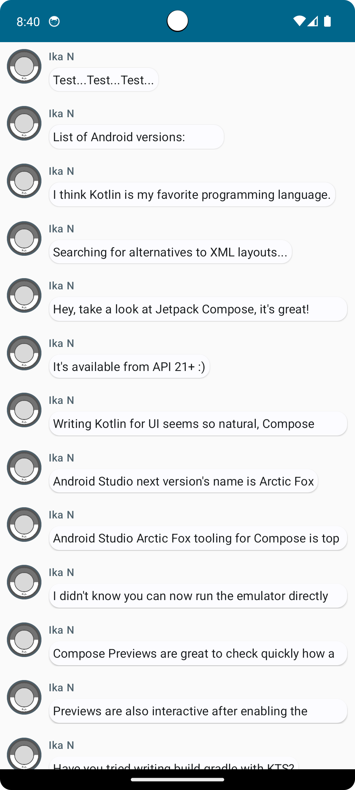
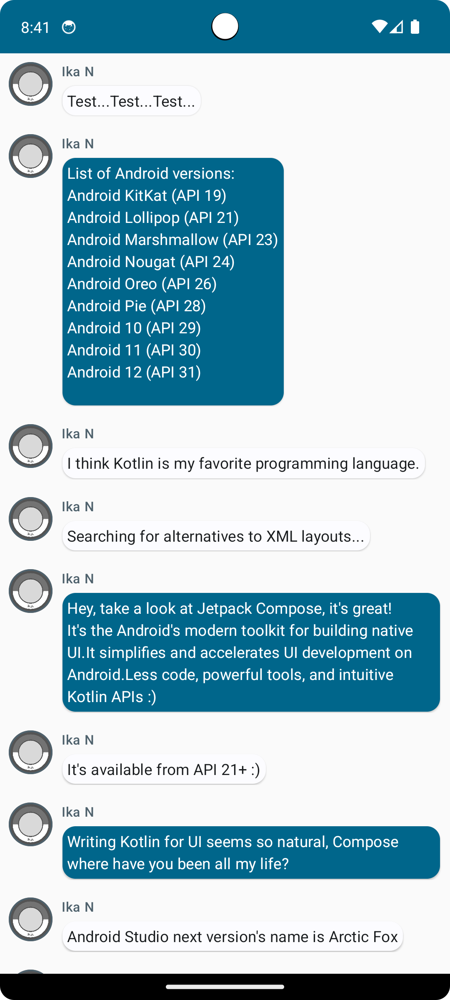

# MyApplication
Hai, perkenalkan saya Ika Nurfitriani! Repositori ini merupakan hasil latihan projek kelas dengan referensi berasal dari codelab dan projek ini adalah hasil revisi dari projek `First Application`. Projek ini diberi nama My Application. Setelah direvisi, projek ini sudah sampai tahap akhir dimana aplikasi menampilkan layar chat sederhana.

# Fitur-Fitur
- Home: Aplikasi menampilkan daftar pesan yang dapat diperluas & animasi yang berisi gambar dan teks.

# Screenshot Aplikasi
Berikut ini adalah hasil screenshot dari aplikasi My Application:

 

## Author
[@Ika Nurfitriani](https://github.com/ikanurfitriani)